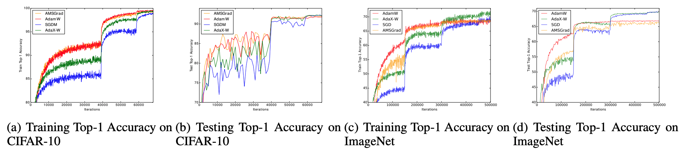

# AdaX: Adaptive Gradient Descent with Exponential Long Term Momery

A new adaptive optimizer that can run faster than Stochastic Gradient Descent with momentum (SGDM) and outperform Adam in many Computer Vision and Natural Language Processing tasks.

#### This is a Pytorch Implementation. If you know how to implement the algorithm in Tensorflow, please leave a message.


## Performance

We compared AdaX with SGDM, Adam and AMSGrad on different deep learning tasks and the report the results in the following images. As can be observed, AdaX outperformed Adam in all the tasks and could catch up with SGDM.


<p align="center"></p>
<p align="center"></p>


## Usage 

We have implemented both AdaX with L2 regularization (AdaX) and AdaX with decoupled weight decay (AdaX-W). Please be notified that they have different step sizes (lr) and different weight decays (weight_decay). Currently, AdaX-W yields the best results and we recommend using it with the default hyper-parameters (beta1 = 0.9, beta2 = 1e-4).

For the weight decay on different datasets, please use 5e-2 on CIFAR-10 as a general setting for tasks in Computer Vision.

You can simply use AdaX-W as how you use other Pytorch optimizers:

```python3
from AdaX import AdaXW
# suppose your DNN is named 'model'
optimizer = AdaXW(model.parameters(), lr = 0.005, weight_decay=5e-2)
```


## License
[Apache 2.0](./LICENSE)
